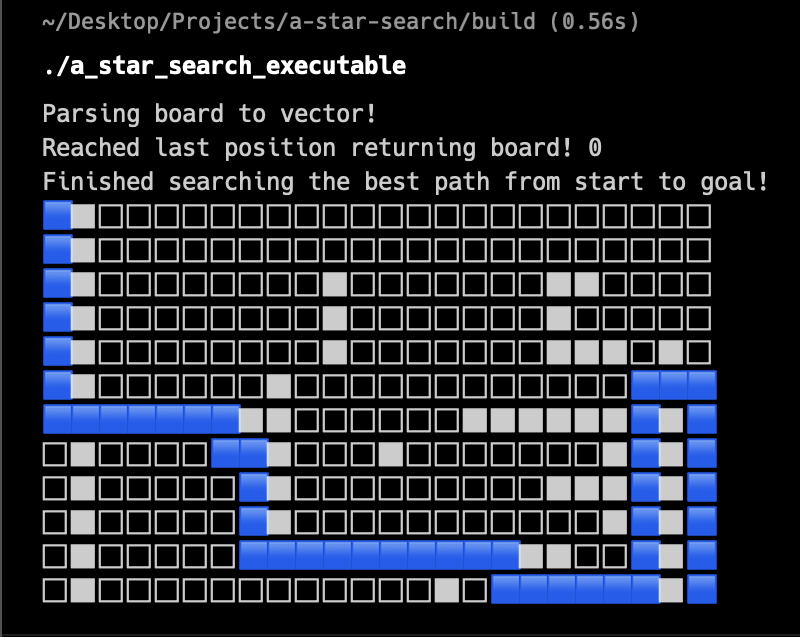

# A* Search
made with c++ the algorithm tries to find the shortest path between nodes. At its core, A* explores potential paths by considering both the actual cost of reaching a node from the start point and an estimate of the cost to reach the goal from that node. The estimate, also referred to as the heuristic, will guide the algorithm towards the most promising nodes, leading to a faster convergence towards the optimal solution. By continually selecting the most promising nodes to explore, A* is able to efficiently navigate through large graphs while guaranteeing optimality under certain conditions.

<p align='center'>
    
</p>

## Build
You'll need a c++ compiler and cmake

At the project root folder run
```
mkdir build && cd build
```

Inside the build folder run
```
cmake ..
make
```

## Run
Inside the build directory run
```
./a_star_search_executable
```